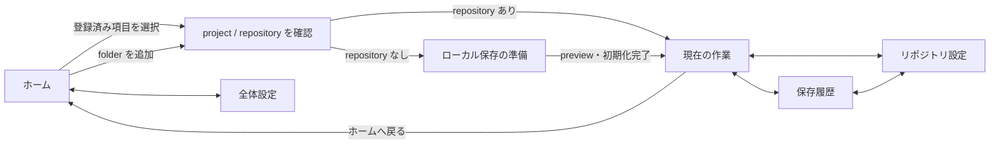

# アプリ画面構成と設定スコープ設計

Status: Phase 2 In Progress
Date: 2026-08-12

## 目的

現在の単一画面に集まっている project 選択、診断、保存、履歴、ログ、設定を、ユーザーの作業単位に沿って分離する。

中心となる導線は次のとおりとする。

1. ホームで対象 project / repository を選ぶ
2. 選択後、その repository の作業画面へ移る
3. 「現在の作業」で変更確認と保存を行う
4. 「保存履歴」で過去の commit、file、diff を確認する
5. アプリ全体の設定と、選択中 repository にだけ適用する設定を別画面で扱う

UI 上では Git の用語だけを主語にせず、「現在の作業」「作業を保存」「保存履歴」を基本表現とする。必要な場所では `repository`、`commit`、`diff` 等を補足する。

## 情報構造

```text
Vsedi
├─ ホーム
│  ├─ project / repository を追加
│  ├─ 登録済み project 一覧、名前・path・タグ検索
│  ├─ タグによる一覧絞り込み
│  └─ 実行環境に問題がある場合だけ要約を表示
├─ 選択中 repository
│  ├─ 現在の作業
│  │  ├─ repository / Unity / VRChat の状態要約
│  │  ├─ 未保存の変更
│  │  ├─ worktree diff
│  │  └─ 保存メモと「作業を保存」
│  ├─ 保存履歴
│  │  ├─ commit 一覧
│  │  ├─ commit 詳細
│  │  ├─ file diff
│  │  └─ 将来: 安全な復元
│  └─ リポジトリ設定
│     ├─ VPM package の追跡方針
│     ├─ .gitignore / Packages/.gitignore の診断と適用 preview
│     ├─ repository / project 情報
│     └─ 将来: remote / branch / backup 方針
└─ 全体設定
   ├─ 一般
   ├─ 新規 repository の既定値
   ├─ 実行環境
   └─ ログと診断
```

## 画面遷移

アプリ起動時は必ずホームを表示する。現在のように最近使った project を自動的に作業画面へ読み込む動作は行わない。ユーザーがカードを選ぶか、新しい folder を選択した時点で repository の作業画面へ移る。



選択した folder が Unity project ではない場合や、安全上の理由で管理できない場合は作業画面へ進めず、ホーム上で理由と再選択導線を表示する。Git repository が未作成の Unity project はエラーとせず、「ローカル保存の準備」へ進める。

## 共通レイアウト

メインウィンドウは `AppShell` を持ち、次を常に同じ位置に置く。

- 左側: ホーム、選択中 repository の各画面、全体設定への navigation
- 上部: 現在の画面名、選択中 project 名、repository 状態、再読込
- 本文: 各画面の内容
- 通知領域: 成功、警告、処理途中で状態が変わった可能性を持つエラー

repository が選択されていない間は、左側の「現在の作業」「保存履歴」「リポジトリ設定」を無効表示するのではなく非表示にする。選択中 repository の切替は一度ホームへ戻って行う。

初期版では別ウィンドウを増やさず、ログ表示だけ既存の専用ウィンドウを維持する。

## 各画面の責務

### ホーム

ホームは対象を選ぶための入口に限定し、詳細な保存操作や設定編集を置かない。

- 「project を追加」ボタン
- 管理している project の一覧。件数上限を設けず、最終更新が新しい順に表示
- 各カードに project 名、種別、Unity version、最終利用日時、folder の存在状態を表示
- project ごとの複数タグと、タグによる一覧の絞り込み
- project 名、path、タグを対象にした管理Project検索
- repository に未保存変更や要確認状態がある場合は短い badge だけ表示
- System Git 未検出など、全 repository に影響する問題がある場合は上部に案内を表示
- stale path は削除せず、「場所を再指定」と「一覧から削除」を提供する

カードの主表示は VRChat 制作者が識別しやすい project folder 名とし、repository root は詳細情報として扱う。親 folder が Git root の場合も、保存対象が repository 全体であることを選択後の header で明示する。

### 現在の作業

repository を開いた直後の既定画面とする。

- Unity / VRChat / source control 診断の要約
- repository 全体の変更一覧
- project 外の変更の明示
- file 選択による worktree diff
- conflict、既存 staged 変更等の blocking reason
- 保存メモ入力
- 「作業を保存」と保存結果

診断の詳細設定はこの画面へ置かない。ユーザーの操作で解消できる問題は、該当するリポジトリ設定への導線を表示する。

### 保存履歴

一覧と詳細を同じ画面内の master-detail 構成で表示する。

- 左側: commit の保存メモ、日時、短い commit ID
- 右側: 選択 commit の完全な ID、日時、変更 file
- file 選択後: text diff、binary、表示不可、truncated の状態
- M4 では詳細側へ「この状態に戻す」を追加し、復元 preview へ進める

履歴選択と diff 表示は repository を変更しない。復元は別の確認段階を持ち、履歴を選択しただけでは開始しない。

### リポジトリ設定

選択中 repository のみに影響する項目と、repository 内の設定ファイルの診断・変更を扱う。

- VPM package の追跡方針: 「全体設定に従う / 除外する / 含める」
- 現在の実効値と、その値が全体既定値か repository override かを表示
- `.gitignore` と `Packages/.gitignore` の現在状態
- 不足 rule の preview と適用
- repository root、Unity project root、Unity version、project 種別の読み取り専用情報
- Finder / Explorer で project folder を開く導線
- 将来の remote URL、通常 branch、リモートバックアップ状態

設定画面を開いただけでは repository 内を変更しない。`.gitignore` 等の変更は必ず preview と明示的な適用操作を経由する。

### 全体設定

repository を選択していなくても利用でき、アプリ全体または新規 repository の既定値にだけ影響する。

#### 一般

- 初回案内の再表示など、将来の UI 設定
- 登録済み project の管理

#### 新規 repository の既定値

- VPM package 追跡方針の既定値
- Unity `.gitignore` template
- VPM package 用 ignore template

template の変更は既存 repository に自動適用しない。既存 repository へ反映する場合は、各リポジトリ設定で差分を preview する。

#### 実行環境

- OS / architecture
- System Git executable / version
- 将来の Unity、VCC、ALCOM 診断

#### ログと診断

- ログレベル
- ログ表示
- ログ folder を開く
- 診断ログを書き出す
- 保持期間と、現在は保持対象の全ログを表示する旨

## 現在の機能の振り分け

| 現在の要素 | 移動先 | 理由 |
| --- | --- | --- |
| folder 選択、管理Project一覧 | ホーム | repository を開く入口 |
| OS / System Git の詳細 | 全体設定 > 実行環境 | 全 repository 共通 |
| System Git の重大な問題 | ホームの要約 | repository を開く前に行動が必要 |
| Unity / VRChat 診断要約 | 現在の作業 | 保存可否の判断に必要 |
| VPM package 追跡方針 | 全体設定の既定値 + リポジトリ設定の override | repository ごとに異なる運用を許容 |
| ignore template の編集 | 全体設定 > 新規 repository の既定値 | 新規作成時の基準 |
| `.gitignore` の診断・適用 | リポジトリ設定 | 実際の repository file に作用 |
| repository 初期化 | ホームから始まる準備 flow | 作業画面へ入る前の一度だけの操作 |
| 現在の変更、保存メモ、保存 | 現在の作業 | 日常操作の中心 |
| worktree diff | 現在の作業 | 未保存変更の確認 |
| commit 一覧、詳細、diff | 保存履歴 | 過去状態の確認 |
| 将来の安全な復元 | 保存履歴の commit 詳細 | 復元対象の選択元 |
| ログレベル、表示、folder、export | 全体設定 > ログと診断 | アプリ全体の診断機能 |

## 設定スコープと保存形式

### 基本規則

設定値は次の3種類を混同しない。

1. **アプリ全体設定**: 全 repository に共通する UI・ログ設定
2. **新規 repository の既定値**: repository override がない場合の既定動作
3. **リポジトリ設定**: 選択中 repository だけに適用する override

実効値は次の順で決める。

```text
repository override がある → override を使用
repository override がない → 全体の既定値を使用
全体の既定値も読み取れない → schema の安全な既定値を使用
```

### 現行 schema

既存の `recentProjects`、`logLevel`、`vpmTrackingPolicy`、`ignoreTemplates` は維持する。`recentProjects[].category` はschema 6で`tags[]`へ移行し、repository固有設定も同じschemaで保持する。

```text
AppSettings
├─ schemaVersion
├─ onboardingCompleted
├─ recentProjects[]
│  ├─ path
│  ├─ lastOpenedAt                  # 開く・タグ変更で更新する管理上の最終更新日時
│  └─ tags[]                        # アプリ内の一覧タグ。repositoryには書き込まない
├─ logLevel                         # アプリ全体
├─ vpmTrackingPolicy               # 全体の既定値
├─ ignoreTemplates                 # 新規 repository の既定値
└─ repositorySettings[]
   ├─ repositoryRoot               # canonical path
   └─ vpmTrackingPolicyOverride?   # null / EXCLUDE / INCLUDE
```

`repositorySettings` は app data の `settings.json` に保存し、設定画面を開いたり override を変更しただけで repository を dirty にしない。`.git/config` や repository 内の独自 file へ暗黙に書き込まない。実効VPM方針は、repository rootが一致するoverride、全体既定値、安全なschema既定値の順で解決し、診断・初期化preview・初期化実行で同じ解決結果を使う。

repository root は保存前に Rust 側で canonicalize し、比較規則は OS ごとに統一する。存在しなくなった path の設定は黙って削除せず、登録済み project と同様に stale 状態として扱う。repository が移動された場合は、ユーザーが再選択した時点で旧 path から設定を引き継ぐか確認できる設計を後続で追加する。

## Frontend の状態境界

画面遷移は、重い診断 DTO を route に保持せず、選択中 project path と画面 ID だけで表現する。

```ts
type AppRoute =
  | { page: "HOME" }
  | { page: "GLOBAL_SETTINGS"; section: "GENERAL" | "DEFAULTS" | "ENVIRONMENT" | "LOGGING" }
  | {
      page: "REPOSITORY";
      projectPath: string;
      section: "WORK" | "HISTORY" | "SETTINGS";
      commitId?: string;
      filePath?: string;
    };
```

初期実装では web URL の routing library を必須にせず、型付きの navigation state で実装できる。ただし page component 内の個別 state に画面遷移を分散させず、`AppShell` が route を管理する。将来 deep link や window state 復元が必要になった時点で router 導入を再評価する。

データは次の単位で読み込む。

- 起動時: app settings と最低限の environment summary
- ホーム: recent project status
- repository 選択時: project diagnostic と repository context
- 現在の作業: repository state と worktree snapshot
- 保存履歴: history。一覧選択後に commit detail、file 選択後に diff
- 各設定画面: その画面が編集する設定だけ

アプリ全体を止める単一 `busy` state は廃止し、画面または操作単位の pending state を持つ。repository を切り替えた場合は、前の repository に対する遅い応答を新しい画面へ反映しないよう request generation または cancellation を使う。

## Frontend の分割案

```text
src/
├─ app/
│  ├─ AppShell.tsx
│  ├─ navigation.ts
│  └─ RepositoryContext.tsx
├─ pages/
│  ├─ HomePage.tsx
│  ├─ WorkPage.tsx
│  ├─ HistoryPage.tsx
│  ├─ RepositorySettingsPage.tsx
│  └─ GlobalSettingsPage.tsx
├─ features/
│  ├─ project-selection/
│  ├─ diagnostics/
│  ├─ save/
│  ├─ history/
│  └─ settings/
└─ components/
   └─ ui/
```

page は配置とデータ取得の調停を担当し、保存、履歴、設定等の操作は feature 単位へ分ける。Tauri command wrapper は引き続き `src/lib/commands.ts` に集約し、Frontend から任意の Git command を組み立てない。

## 実装順序

### Phase 1 — 画面分割のみ

- `AppShell` と型付き navigation state を追加
- ホーム、現在の作業、保存履歴、全体設定へ既存 UI を移動
- repository 設定画面を追加し、当初は診断情報と全体既定値への導線だけを表示
- backend DTO と設定 schema は変更しない

この段階で保存・履歴の挙動を変えず、巨大な `App.tsx` の分割と画面遷移を先に安定させる。

### Phase 2 — リポジトリ設定

- `repositorySettings` と schema migrationを追加済み
- VPM tracking policyの全体既定値とrepository overrideを実装済み
- 診断、初期化preview、初期化実行が同じ実効設定をRust側で解決
- リポジトリ設定画面に実効値・設定由来・override操作を追加
- 全体設定にignore template editor、リポジトリ設定に不足ruleのpreview・明示適用を追加

### Phase 3 — 操作品質

- loading / empty / stale / error 状態を画面単位で整備
- keyboard focus、戻る導線、native window size を確認
- Mac native smoke test
- Windows native test は利用可能になった時点で実施

### Phase 4 — M4 接続

- 保存履歴の commit 詳細から restore preview へ進む導線を追加
- safety snapshot と復元結果を履歴画面内の明示的な flow として表示

## 受け入れ条件

- 起動直後はホームが表示され、repository 操作が混在しない
- 登録済み project または新しい folder を選ぶと「現在の作業」へ移る
- 現在の変更と保存履歴が別画面で、それぞれ独立して再読込できる
- 全体設定は repository 未選択でも開ける
- リポジトリ設定は repository 選択中だけ開ける
- VPM tracking policy の全体既定値と repository override の由来が画面上で分かる
- 設定画面を開いただけでは repository が変更されない
- `.gitignore` 等の repository file は preview なしで変更されない
- repository 切替後に前の repository の非同期結果が表示されない
- Git の危険な操作は引き続き Rust の application service 境界内に限定される

## 今回の設計で行わないこと

- M4 の restore 操作そのものの設計変更
- M5 の remote 同期 UI 詳細
- 複数 repository を同時に別 window で開く機能
- branch、rebase、stash、reset 等の高度な Git UI
- repository 内への Vsedi 独自設定 file の自動作成
